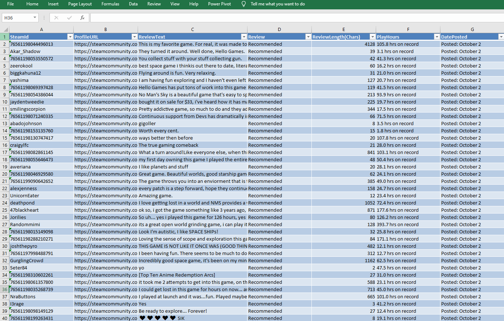

# Steam-Game-Review-Scraper
 Extract reviews and user info for any game on Steam.  (Unless you really just want to scrape this data... you are better of just using the API, which I didn't know about when I wrote this code) >> https://github.com/woctezuma/download-steam-reviews.
 
## Requirements
You'll need to install the following libraries before beginning this project:
- [Selenium](https://www.selenium.dev/downloads/) : for automating the web browser; this can be involved... so check my [short YouTube video](https://youtu.be/9XAH_TvxwLg) for a walkthrough.
- [OpenPyXL](https://openpyxl.readthedocs.io/en/stable/) : for saving the data to an Excel spreadsheet (optional)

## Example
[Click to view Excel file](https://drive.google.com/file/d/1Ld04lwFY7OjIMU2wJxRcgdPvJ0o43BRo/view?usp=sharing)  
  

